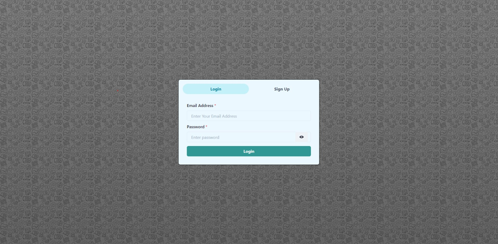

# Team Collaboration Chat

## Overview

This is a real-time chat application built using React, Chakra UI, and Socket.io. It allows users to register, log in, and engage in one-on-one or group chats with friends. The app includes a user-friendly interface for searching users, managing chat rooms, and displaying notifications for new messages. this site t=is available on : https://team-collaboration-chat.vercel.app

.

## Features

- User Authentication: Users can log in or sign up to access the chat functionalities.
- Real-Time Messaging: Utilize Socket.io to provide real-time message updates between users.
- Search Functionality: Easily search for users to initiate chats.
- Group Chat Creation: Users can create group chats and manage participants.
- Responsive Design: The application is designed to be responsive and works seamlessly on various devices.
- Notifications: Users receive notifications for new messages while they are in the app.


## Getting Started
- Clone the Repository:
```
git clone https://github.com/desai-pratik/team-collaboration-chat
cd chat-app
```
- Install Dependencies:
```
npm install
```
- Start the Application:
```
npm start
```
- Open in Browser: Visit http://localhost:3000 to access the application.
